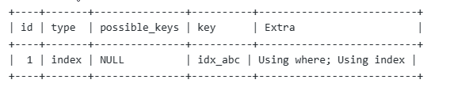
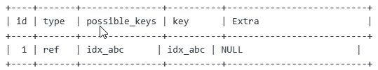
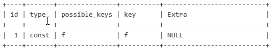
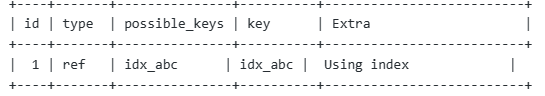
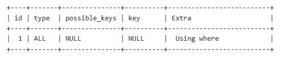

# SQL执行计划分析的时候，要关注哪些信息？

一个explain执行计划中，共有12个字段，每个字段都挺重要的，先来介绍下这12个字段：

1.id:执行计划中每个操作的唯一标识符。对于一条查询语句，每个操作都有一个唯一的id。但是在多表join的时候，一次explain中的多条记录的id是相同的。 

2.select_type:操作的类型。常见的类型包括SIMPLE、PRIMARY、SUBQUERY、UNION等。不同类型的操作会影响查询的执行效率。

 3.table:当前操作所涉及的表。

4.partitions:当前操作所涉及的分区。

 5.type:表示查询时所使用的索引类型，包括ALL、index、range、ref、eq_ref、const等。 

6.possible keys:表示可能被查询优化器选择使用的索引。

 7.key:表示查询优化器选择使用的索引。 

8.key len:表示索引的长度。索引的长度越短，查询时的效率越高。 

9.ref:用来表示哪些列或常量被用来与key列中命名的索引进行比较。

10.rows:表示此操作需要扫描的行数，即扫描表中多少行才能得到结果。

 11.filtered:表示此操作过滤掉的行数占扫描行数的百分比。该值越大，表示查询结果越准确。

 12.Extra:表示其他额外的信息，包括Using index、Using filesort、Using temporary等。

假如我们有如下一张表(MySQL Innodb5.7):

```sql
CREATE TABLE t2( id INT(11), a varchar(64) NOT NULL, b varchar(64)NOT NULL, c varchar(64)NOT NULL, d varchar(64)NOT NULL, f varchar(64)DEFAULT NULL, PRIMARY KEY(id), UNIQUE KEY f (f), KEY idx_abc (a,b,c))ENGINE=InnoDB DEFAULT CHARSET=latin1
```

挑其中比较重要的几个字段分别介绍下他们的不同值都有哪些区别：

首先说type,他有以下几个取值内容，并给出了具体的SQL(以下SQL是我实际测试过的，但是具体的表内容不一样可能最终优化器优化后的效果可能也不一样。)

- system:系统表，少量数据，往往不需要进行磁盘IO
- const:使用常数索引，MySQL只会在查询时使用常数值进行匹配。 explain select from t2 where f='666';。使用唯一性索引做唯一查询
- eq_ref:唯一索引扫描，只会扫描索引树中的一个匹配行。 explain select from t1 join t2 on t1.id t2.id where t1.f1 ='s';。当在连接操作中使用了唯一索引或主键索引，并且连接条件是基于这些索引的等值条件时，MySQL通常会选择eq_ref连接类型，以提高查询性能。
- ref:非唯一索引扫描，只会扫描索引树中的一部分来查找匹配的行。 explain select from t2 where a ='666';。使用非唯一索引进行查询。
- range:范围扫描，只会扫描索引树中的一个范围来查找匹配的行。 explain select from t2 where a >'a' and a <'c';。使用索引进行性范围查询
- index:全索引扫描，会遍历索引树来查找匹配的行。 explain select c from t2 where b ='s';。不符合最左前缀匹配的查询
- ALL:全表扫描，将遍历全表来找到匹配的行。。 explain select from t2 where d="ni"。使用非索引字段查询。

需要注意的是，这里的index表示的是做了索引树扫描，效率并不高。以上类型**由快到慢： system>const eq_ref >ref>range>index >ALL**

再来说说possible_keys和key,possible_keys表示查询语句中可以使用的索引，而不一定实际使用了这些索引。这个字段列出了可能用于这个查询的所有索引，包括联合索引的组合。而ky字段表示实际用于查询的索引。如果在查询中使用了索引，则该字段将显示使用的索引名称；
接着说一个很重要的字段，但是经常被忽略的字段**extra**,这个字段描述了MySQL在执行查询时所做的一些附加操作。下面是Extra可能的取值及其含义：

- Using where:表示MySQL将在存储引擎检索行后，再进行条件过滤（使用HERE子句）；查询的列未被索引覆盖，wheret筛选条件非索引的前导列或者where筛选条件非索引列。 explain select from t2 where d "ni";非索引字段查询 explain select d from t2 where b "ni";未索引覆盖，用联合索引的非前导列查询
- Using index:表示M小ySQL使用了覆盖索引（也称为索引覆盖）优化，只需要扫描索引，而无需回到数据表中检索行； explain select b,c from t2 where a="ni";索引覆盖
- Using index condition:表示查询在索引l上执行了部分条件过滤。这通常和索引下推有关。 explain select d from t2 where a "ni"and b like "s%";使用到索引下推。
- Using where;Using index:查询的列被索引覆盖，并且where筛选条件是索引列之一，但不是索引的前导列，或者wheret筛选条件是索引列前导列的一个范围  explain select a from t2 where b "ni";索引覆盖，但是不符合最左前缀 explain select b from t2 where a in ('a','d','sd');索引覆盖，但是前导列是个范围
- Using join buffer:表示MySQL使用了连接缓存； explain select from t1 join t2 on t1.id t2.id where a ='s
- Using temporary:表示MySQL创建了临时表来存储查询结果。这通常是在排序或分组时发生的： explain select count(*),b from t2 group by b;*
- Using filesort:表示MySQL将使用文件排序而不是索引l排序，这通常发生在无法使用索引来进行排序时； explain select count(*),b from t2 group by b

# 如何判断一条SQL走没有索引

情况一：  explain select b from t2 where a in ('a','d','sd');



type=index,key=idx_abc,extra=Using where;Using index,表示本次查询用到了idx abc的联合索引，但是没有遵守最左前缀匹配，或者遵守了最左前缀，但是使用了字段进行了范围查询。所以，**最终其实还是扫描了索引树的。效率并不高**。

情况二： explain select from t2 where a '666‘;



表示用到了索引进行查询，并且用到的是idx_abc这个非唯一索引。

情况三： explain select from t2 where f ='f';



表示用到了索引进行查询，并且用到的是这个唯一索引。

情况四：explain select b,c from t2 where a '666';



表示用到了索引进行查询，并且用到了idx_abc这个索引，而且查询用到了覆盖索引，不需要回表。

情况五： explain select b,c from t2 where d '666';




表示没有用到索引。