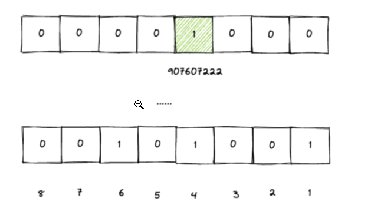
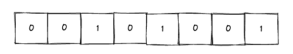

# 40亿个QQ号，限制1G内存，如何去重？

10位数字的QQ号，想要去重，又不给那么多的空间，该如何实现呢？ 40亿个unsigned int,如果直接用内存存储的话，需要： 4*4000000000/1024/1024/1024=14.9G,1G的空间远远不够用。想要实现这个功能，可以借助位图。

使用位图的话，一个数字只需要占用1个bit,那么40亿个数字也就是：4000000000*1/8/1024/1024=476M。相比于之前的14.9G来说，大大的节省了很多空间。比如要把我的QQ号"907607222"放到Bitmap中，就需要找到第907607222这个位置，然后把他设置成1就可以了。

这样，把40亿个数字都放到Bitmap,之后，所有位置上是1的表示存在，不为1的表示不存在，相同的QQ号只需要设置一次1就可以了，那么，最终就把所有是1的数字遍历出来就行了。

## 什么是位图

位图(BitMap),基本思想就是用一个bit来标记元素，bit是计算机中最小的单位，也就是我们常说的计算机中的 0和1，这种就是用一个位来表示的。所谓位图，其实就是一个bit数组，即每一个位置都是一个bit,其中的取值可以是0或者1

像上面的这个位图，可以分别来表示1,4,6。表示到6只要6个bit。如果不用位图的话，我们想要记录1,4，，6这三个整型的话，就需要用三个unsigned int,已知每个unsigned int占4个字节，那么就是3x4=12个字节，一个字节有8bit,那么就是12*8=96个bit。所以，位图最大的好处就是**节省空间**。