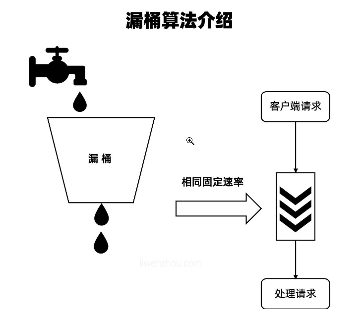
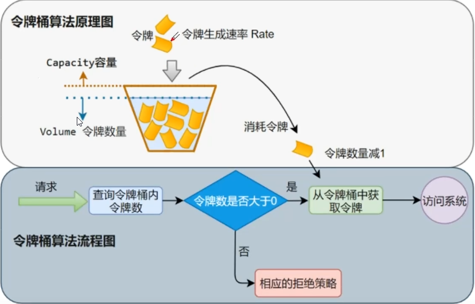
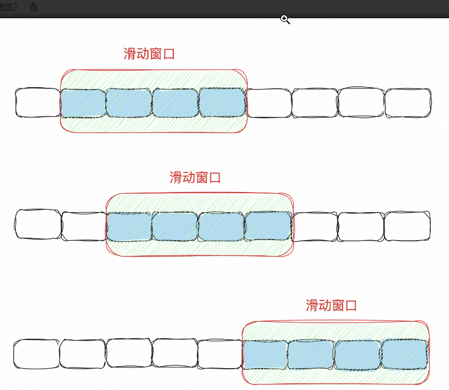
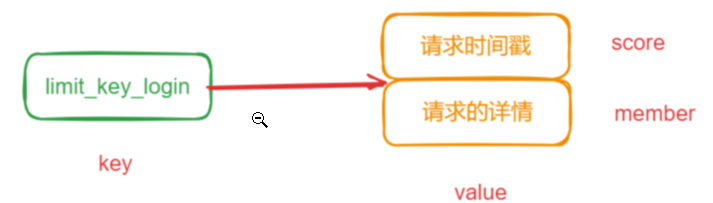

# 限流

限流是一种控制流量的技术，用于保护系统**免受突发流量或恶意流量的影响**。其基本原理是通过控制请求的速率或数量，确保系统在可承受的范围内运行。

## 常用限流算法

### 漏桶

漏桶算法是一种流量控制算法，可以平滑控制流量的进出，原理比较简单：假设我们有一个水桶按固定的速率向下方滴落一滴水，无论有多少请求，请求的速率有多大，都按照固定的速率流出，对应到系统中就是按照固定的速率处理请求。



漏桶算法通过一个固定容量的漏桶来控制请求的处理速率，每个请求被看作是一定数量的水，需要先放到漏桶中。当漏桶满时，请求将被拒绝或延迟处理，从而保证了系统的稳定性。

漏桶通过定时器的方式将水以恒定的速率流出，与请求的数量无关，从而平滑控制了请求的处理速率。当请求到来时，先将请求看作是一定数量的水，需要将这些水放入漏桶中。如果漏桶未满，请求将被立即处理并从漏桶中取出对应数量的水。如果漏桶已满，请求将被拒绝或被延迟处理，直到漏桶中有足够的空间存放请求对应数量的水。当定时器触发时，漏桶中的水以恒定的速率流出，此时可以继续处理请求。

总之，**漏桶算法通过一个固定容量的漏桶来控制情求的处理速率，可以平滑控制流量的进出，保证系统的稳定性和安全性**。但需要注意的是，漏桶算法**无法处理突发流量**，因为他只能按照固定的速度来处理请求，如果某个请求的流量突增，因为漏桶的机制就导致了他还是只能一个一个的按照固定速度进行消费。为了解决这种突发流量的问题，就有了令牌桶算法。

代码简单实现：

```Java
public class LeakyBucketLimiter {
    private long timeStamp=System.currentTimeMillis();
    private long capacity=100;//桶的容量
    private long rate=100;//水漏出的速率（系统每秒处理请求的速率）
    private long water=20;//当前水量（当前累计请求数）

    /**
     * 返回true代表限流，false代表通过
     * @return
     */
    public synchronized boolean limit(){
        long now=System.currentTimeMillis();
        water=Math.max(0,water-(now-timeStamp)/1000*rate);
        timeStamp=now;
        if(water+1<=capacity){
            //水未满，加水
            water++;
            return false;
        }else {
            //水满，拒绝加水，被限流
            return true;
        }
    }
}
```

### 令牌桶

令牌桶其实和漏桶的原理类似，令牌桶按固定的速率往桶里放入令牌，并且只要能从桶里取出令牌就能通过。也就是说，我不管现在请求量是多还是少，都有一个线程以固定的速率再往桶里放入令牌，而有请求过来的时候就会去桶里取出令牌，能取到就执行，取不到就拒绝或者阻塞。

也就是说，我不管现在请求量是多还是少，都有一个线程以固定的速率再往桶里放入令牌，而有请求过来的时候，就会去桶里取出令牌，能取到就执行，取不到就拒绝或者阻塞。



令牌桶通过定时器的方式向桶中添加令牌，每秒钟添动加一定数量的令牌，从而平滑控制了请求的处理速率。这样如果突发流量过来了，只要令牌桶中还有足够的令牌，就可以快速的执行，而不是像漏桶一样还要按照固定速率执行。令牌桶的好处就是把流量给平滑掉了，在流量不高的时候也会不断的向桶中增加令牌，这样就有足够的令牌可供请求消费。在Java中，我们可以借助Guava提供的RateLimiter来实现令牌桶。

代码简单实现：

```java
public class TokenBucketLimiter {
    private final int capacity=100;//令牌桶的容量
    private final int rate=5;//令牌生成速率
    private volatile AtomicInteger tokens=new AtomicInteger(0);//桶中令牌数量

    /**
     * 开启一个线程固定频率往桶中放入令牌
     */
    private void productToken(){
        ScheduledExecutorService scheduledExecutorService = Executors.newScheduledThreadPool(1);
        scheduledExecutorService.scheduleAtFixedRate(()->{
            tokens.set(Math.min(capacity,tokens.get()+rate));
        },0,1, TimeUnit.SECONDS);//一秒执行一次
    }
    private boolean isLimited(int requestCount){
        if(tokens.get()<requestCount)
            return true;//被限流
        else {
            tokens.getAndAdd(-requestCount);
            return false;
        }
    }
}
```


### 滑动窗口限流

滑动窗口限流是一种流量控制策略，用于控制在一定时间内允许执行的操作数量或请求频率。它的工作方式类似于一个滑动时间窗口，在窗口内允许的操作数量是固定的，窗口会随着时间的推移不断滑动。



首先需要把时间划分成多个连续的时间片段，每一个片段都有一个固定的时间间隔，如1s、1h等。然后再定义一个时间窗口，比如10s,随着时间的推移，这个窗口不断的向右移动。

为了实现限流的功能，我们通常需要定义一个计数器，统计时间窗口内的请求数。当时间窗口移动时，需要把上一个时间片段中的请求数减掉，当有新的请求或操作到达系统时，系统会检查窗口内的计数是否已满。如果计数未满，请求被允许执行；如果计数已满，请求被拒绝或进入等待队列，或执行其他限流操作。

滑动窗口限流的主要优点是可以在时间内平滑地控制流量，而不是简单地设置固定的请求数或速率。这使得系统可以更灵活地应对突发流量或峰值流量，而不会因为固定速率的限制而浪费资源或降低系统性能。

#### 基于redis实现滑动窗口

在Redis中，我们可以基于ZSET来实现这个功能。假如我们限定login接口一分钟只能调用100次：那么，我们就可以把login接口这个需要做限流的资源名作为key在redis中进行存储，然后value我们现在ZSET这种数据结构，把他的score设置为当前请求的时间戳，member用请求的详情的hash进行存储（或者 UUID、MD5)，避免在并发时，时间戳一致出现score和member一样导致被zadd幂等的问题。



所以，我们实现滑动窗口限流的主要思想是：只保留在特定时间窗口内的请求记录，而丢弃窗口之外的记录主要步骤如下： 

1.定义滑动窗口的时间范围，例如，窗口大小为60秒。 2.每次收到一个请求时，我们就定义出一个zset然后存储到redis中。 3.然后再通过ZREMRANGEBYSCORE命令来删除分值小于窗口起始时间戳（当前时间戳-60s)的数据。 4.最后，再使用ZCARD命令来获取有序集合中的成员数量，即在窗口内的请求量。

```Java
public class slidingwindowRateLimiter {
    private Jedis jedis;
    private String key;
    private int limit;

    public boolean allowRequest(String key) {
        long currentTimeMillis = System.currentTimeMillis();
        //窗口开始时间戳
        long startWindows=currentTimeMillis-60*1000;
        //窗口滑动，删除窗口之前的所有数据
        jedis.zremrangeByScore(key,"-inf",String.valueof(windowStart));
        //计算总请求数
        long currentRequests =jedis.zcard(key);
        //如果窗口足够把当前请求加进去
        if(currentRequests<limit){
        jedis.zadd(key,currentRequests,currentRequests,String.valueOf(currentRequests));
            return true;
        }
        return false;
    }
}
```

以上代码在高并发情况下，可能会存在原子性的问题，需要考虑加lua脚本：

```Java
public class slidingwindowRateLimiter {
    private Jedis jedis;
    private String key;
    private int limit;

    public boolean allowRequest(String key) {
        long currentTime = System.currentTimeMillis();
        String luaScript="local window_start =ARGV[1]-60000\n"+
                "redis.call('ZREMRANGEBYSCORE',KEYS[1],'-inf',window_start)\n"+
                "local current_requests= redis.call('ZCARD',KEYS[1])\n"+
                "if current_requests <tonumber(ARGV[2])then\n"+
                "redis.call('ZADD',KEYS[1],ARGV[1],ARGV[1])\n"+
                "return 1\n"+
                "else\n"+
                "return 0\n"
                +"end";
        Object result=jedis.eval(luaScript,1,key,String.valueOf(currentTime),String.valueOf(limit));
        return (Long)result ==1;
    }
}
```

**ZREMRANGEBYSCORE**

`ZREMRANGEBYSCORE`命令用于从有序集合中移除所有分数在给定范围内的成员。分数范围是闭区间，即包含min和max值本身。

**命令格式**:
```
ZREMRANGEBYSCORE key min max
```

- `key` 是有序集合的键。
- `min` 和 `max` 分别是分数的最小值和最大值。可以使用特殊符号 `-inf` 和 `+inf` 来表示负无穷和正无穷。

**返回值**:
返回被移除元素的数量。

ZCARD

`ZCARD`命令用于获取有序集合中的元素数量，即集合的基数。

**命令格式**:

```
ZCARD key
```

- `key` 是有序集合的键。

**返回值**:
如果键存在并且是有序集合类型，则返回有序集合的基数。如果键不存在或不是有序集合类型，将返回0。

这两个命令可以用来管理和查询有序集合，比如在维护排行榜、计数器或者任何需要排序和限制元素数量的场景中。

### 令牌桶和漏桶区别

来一个请求时漏桶是往桶中加水，令牌桶是从桶中取令牌。当突发流量来时，漏桶还是只能以恒定速率处理请求，而令牌桶可以以更高的速率从桶中取令牌。

所以，漏桶算法适合于需要限制数据的平均传输速率并确保数据传输的平滑性的场景。令牌桶算法更加灵活，适合于那些既需要限制数据平均传输速率，又需要允许一定程度突发传输的场景。

